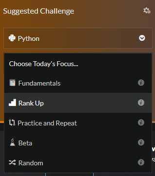

# CodeWars

Repository to save all my daily Codewars' katas answers. 

I (try to) do one kata per workable day. Just after my [daily fingers' warm up](https://www.threads.com/@fcoterroba/post/DKq9P0HIDOK)

I'm expert on PHP and Python so these katas will be on "Rank up" focus. Also I'm learning C++, C# and Rust so they'll be on Fundamentals' focus.

## Structure

- Monday -> [C++](https://github.com/fcoterroba/CodeWars/tree/main/CPP)
- Tuesday -> [C#](https://github.com/fcoterroba/CodeWars/tree/main/CS)
- Wednesday -> [Rust](https://github.com/fcoterroba/CodeWars/tree/main/Rust)
- Thursday -> PHP
- Friday -> Python

## Contributions

Feel free to upload your solution if it's not already uploaded. Inside each language's folder it'll be a folder with the name of the kata. Then inside will be a folder for my solution. You can upload yours creating a kata with your username inside the language's folder.

## Follow me

  